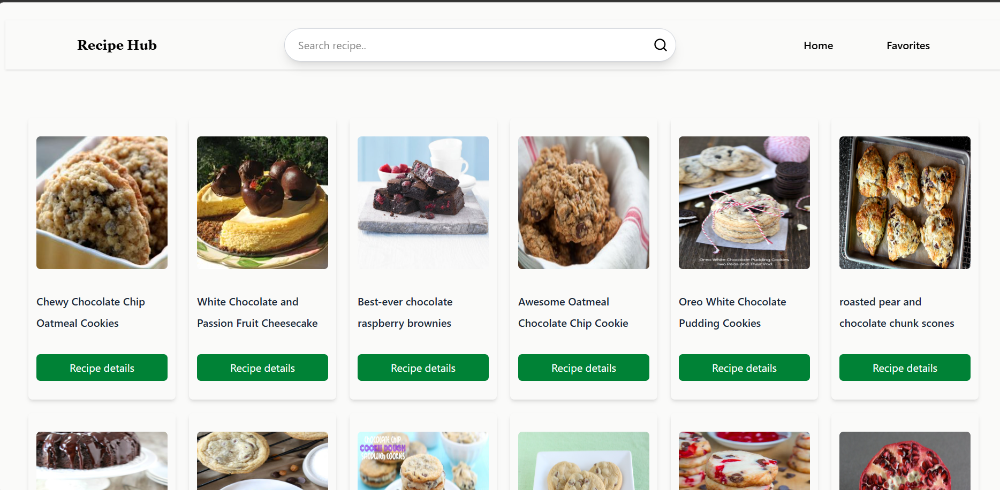
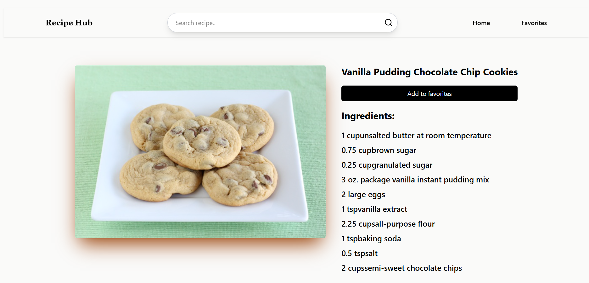
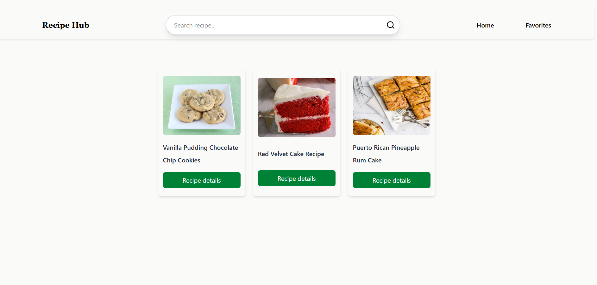

# 🍽️ Recipe Finder

A modern React-based Recipe Finder application that allows users to search for recipes, view detailed cooking instructions and ingredients, and save their favorite recipes for quick access. The application fetches real-time recipe data from the Forkify API and provides a clean, responsive user experience.

---

## 🚀 Features

- 🔍 Search recipes by keyword
- 📖 View detailed recipe information
- 🥘 Display ingredients with quantities and units
- ❤️ Add or remove recipes from Favorites
- 💾 Persist favorite recipes using Local Storage
- ⚡ Fast client-side navigation with React Router
- 📱 Fully responsive interface

---

## 🛠️ Tech Stack

- React.js
- React Router DOM
- Context API
- Tailwind CSS
- JavaScript (ES6+)
- Fetch API
- Local Storage
- Forkify API

---

## 🔗 API Used

This project uses the **Forkify API** to fetch recipe data.

---

## 💡 How It Works

1. Enter a recipe name in the search bar.
2. Browse the list of matching recipes.
3. Click a recipe to view its details.
4. Save your favorite recipes with the **Add to Favorites** button.
5. Access all saved recipes from the **Favorites** page.

---

## 📸 Screenshots

### Home Page

### Recipe Details

### Favorites

---

## 🎯 Future Improvements

- User authentication
- Dark mode
- Pagination
- Search suggestions
- Recent search history

---
GitHub: https://github.com/your-github-username

---

⭐ If you found this project useful, consider giving it a star!
